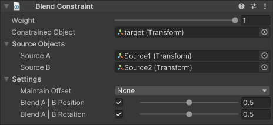

# Blend Constraint

A blend constraint allows the constrained GameObject to blend between GameObject Source A Position
and GameObject Source B Position as well as blending between GameObject Source A Rotation
and GameObject Source B Rotation.

|Properties|Description|
|---|---|
|Weight|The overall weight of the constraint. If set to 0, the constraint has no influence on the Constrained Object. When set to 1, it applies full influence with the current settings. Intermediate values are interpolated linearly.|
|Constrained Object|The GameObject affected by the Source Objects.|
|Source A|The first source GameObject that influences the position and rotation of the Constrained Object.|
|Source B|The second source GameObject that influences the position and rotation of the Constrained Object.|
|Maintain Offset|Specifies whether to maintain the initial offset between the Constrained Object and the Source Objects. You can retain any combination of either Position and/or Rotation offset.|
|Blend A &#124; B Position|If enabled, the constrained GameObject's position blends between those of Source A and Source B by the specified amount. As with the constraint's overall weight, intermediate values are interpolated linearly.|
|Blend A &#124; B Rotation|If enabled, the constrained GameObject's rotation blends between those of Source A and Source B by the specified amount. As with the constraint's overall weight, intermediate values are interpolated linearly.|
