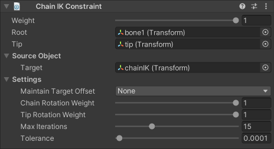

# ChainIK Constraint

The Chain IK constraint allows you to invert the control of a hierarchy of GameObjects, so the end of the chain can reach a target position.
By defining Root and Tip GameObjects, the Chain IK constraint can find and constrain all GameObjects in between.

This constraint implements the FABRIK solver (Forward and Backward Reaching Inverse Kinematic).
More details can be found [here](http://www.andreasaristidou.com/FABRIK.html).

|Properties|Description|
|---|---|
|Weight|The overall weight of the constraint. If set to 0, the constraint has no influence on the chain elements. When set to 1, it applies full influence with the current settings. Intermediate values are interpolated linearly.|
|Root|The root GameObject of the chain hierarchy.|
|Tip|The final GameObject of the chain hierarchy. It must be a descendant of the Root GameObject.|
|Target|The GameObject that specifies the desired target transform for the chain's Tip.|
|Maintain Target Offset|Specifies whether to maintain the initial offset between the Tip and the Target. You can retain any combination of either Position and/or Rotation offset.|
|Chain Rotation Weight|The weight of rotations applied throughout the chain. If set to 1, the chain will fully reach for its target goal. As with the constraint's overall weight, intermediate values are interpolated linearly.|
|Tip Rotation Weight|The weight of the rotation applied to the Tip. If set to 1, the Tip aligns its rotation to the specified Target. As with the constraint's overall weight, intermediate values are interpolated linearly.|
|Max Iterations|The maximum number of solver iterations to perform to try to make the Tip reach the Target within the specified Tolerance threshold.|
|Tolerance|Distance tolerance between the Target and Tip GameObjects. The solver will finish its computation if the distance is less than this value at any point, even if Max Iterations has not been reached.|
