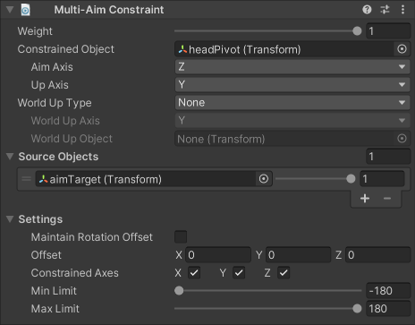

# Multi-Aim Constraint

A Multi-Aim Constraint rotates a Constrained Object to face a target position specified by one or more Source Objects.
It is typically used to make a GameObject look at objects of interest, such as nearby interactable props or the position of the cursor.
You can specify the aim direction by selecting which Aim Axis to use on the Constrained Object (X, -X, Y, -Y, Z, -Z).
You can optionally specify World Up parameters to help the Constrained Object maintain stable roll orientation.

_Note that this constraint's handling of multiple targets is different from that of most third-party 3D animation software.
Specifically, it calculates an aim rotation to each target, and then produces a weighted sum of all these rotations.
This approach allows you to easily blend in or out the effects of individual targets, since their weight values are not normalized prior to calculation.
To replicate the behavior of other 3D animation software, you should use a single Source Object that is constrained to multiple targets via a [MultiPositionConstraint](./MultiPositionConstraint.md)._

|Properties|Description|
|---|---|
|Weight|The overall weight of the constraint. If set to 0, the constraint has no influence on the Constrained Object. When set to 1, it applies full influence with the current settings. Intermediate values are interpolated linearly.|
|Constrained Object|The GameObject affected by the Source Objects.|
|Aim Axis|Specifies the local aim axis of the Constrained Object to use in order to orient its forward direction to the Source Objects.|
|Up Axis|Specifies the local up axis of the Constrained Object to use in order to orient its upward direction (i.e., roll orientation).|
|World Up Type|Specifies which mode to use to stabilize the upward direction (i.e., roll orientation) of the Constrained Object.|
|World Up Axis|A vector in some reference frame that is used to stabilize the upward direction of the Constrained Object. This value is used when World Up Type is either Vector or Object Rotation Up. In those cases, the reference frame is either the world or another object, respectively.
|World Up Object|A GameObject used as a reference frame for World Up Axis. This value is used when World Up Type is either Object Up or Object Rotation Up.|
|Source Objects|The list of GameObjects that influence the Constrained Object's orientation, and the amount of weight they contribute to the final pose. The constraint calculates rotation toward each target to produce a weighted sum. _The order of Source Objects does not affect the result._|
|Maintain Rotation Offset|Specifies whether to maintain the initial rotation offset between the Constrained Object and the Source Objects.|
|Offset|Specifies an additional local space rotation offset to apply to the Constrained Object, after it has been rotated toward its target.|
|Constrained Axes|Specifies the axes to which the constraint can apply rotation.|
|Min Limit|Clamps the minimum rotation that may be applied about any of the constrained axes of rotation.|
|Max Limit|Clamps the maximum rotation that may be applied about any of the constrained axes of rotation.|

World Up Type can have the following values:

|Values|Description|
|---|---|
|None|Do not use a World Up vector.|
|Scene Up|The Y-axis of the scene.|
|Object Up|The Y-axis of the GameObject specified by World Up Object.|
|Object Up Rotation|The axis specified by World Up Vector, in the space of the GameObject specified by World Up Object.|
|Vector|The World Up Vector.|
