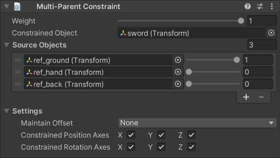

# Multi-Parent Constraint

A Multi-Parent Constraint moves and rotates a GameObject as if it is the child of another GameObject in the Hierarchy window.
Because using this constraint does not actually change the GameObject hierarchy, it offers some advantages:

- It does not affect scale.
- The Constrained Object can have multiple Source Objects (i.e., parents).
- The Constrained Object does not have to be a child of any of the Source Objects.
- You can vary the effect of the constraint by specifying an overall weight, as well as individual weights for each of the Source Objects.
- You can still apply normal animation to the Constrained Object's children as normal.

|Properties|Description|
|---|---|
|Weight|The overall weight of the constraint. If set to 0, the constraint has no influence on the Constrained Object. When set to 1, it applies full influence with the current settings. Intermediate values are interpolated linearly.|
|Constrained Object|The GameObject affected by the Source Objects.|
|Source Objects|The list of GameObjects that influence the Constrained Object's position and orientation, and the amount of weight they contribute to the final pose. The constraint applies linearly interpolated, weighted translation and rotation toward each target. _The order of Source Objects does not affect the result._|
|Maintain Offset|Specifies whether to maintain the initial offset between the Constrained Object and the Source Objects. You can retain any combination of either Position and/or Rotation offset.|
|Constrained Position Axes|Specifies the axes to which the constraint can apply translation.|
|Constrained Rotation Axes|Specifies the axes to which the constraint can apply rotation.|
