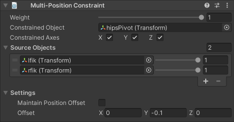

# Multi-Position Constraint

A Multi-Position Constraint component moves a Constrained Object to follow its Source Objects.

|Properties|Description|
|---|---|
|Weight|The overall weight of the constraint. If set to 0, the constraint has no influence on the Constrained Object. When set to 1, it applies full influence with the current settings. Intermediate values are interpolated linearly.|
|Constrained Object|The GameObject affected by the Source Objects.|
|Constrained Axes|Specifies the axes to which the constraint can apply translation.|
|Source Objects|The list of GameObjects that influence the Constrained Object's position, and the amount of weight they contribute to the final pose. The constraint calculates translation toward each target to produce a weighted sum. _The order of Source Objects does not affect the result._|
|Maintain Position Offset|Specifies whether to maintain the initial position offset between the Constrained Object and the Source Objects.|
|Offset|Specifies an additional local space translation offset to apply to the Constrained Object, after it has been moved toward its target.|
