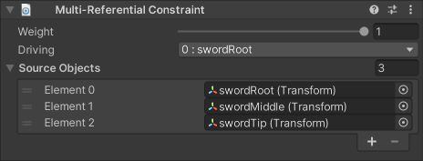

# Multi-Referential Constraint

The Multi-Referential Constraint allows you to configure a group of GameObjects to have dynamic parent-child-like behavior.
The movement of the Driving object influences all of the other Reference Objects as if it were their parent.
Use this constraint to simulate dynamic parenting changes without modifying your hierarchy.
For example, you could configure a character's hand to sometimes control the motion of a prop, and the prop to sometimes control the motion of the hand.

|Properties|Description|
|---|---|
|Weight|The overall weight of the constraint. If set to 0, the constraint has no influence on the Reference Objects. When set to 1, it applies full influence with the current settings. Intermediate values are interpolated linearly.|
|Driving|An object from the list of Referenced Objects, whose motion drives that of all other Referenced Objects.|
|Referenced Objects|A list of GameObjects to be driven by the specified Driving object.|
