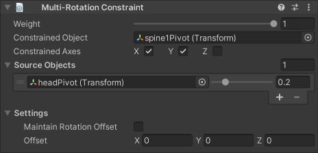

# Multi-Rotation Constraint

A Multi-Rotation Constraint component rotates a Constrained Object to match the rotation of its Source Objects.
The constraint applies rotation about the shortest path to each target.

|Properties|Description|
|---|---|
|Weight|The overall weight of the constraint. If set to 0, the constraint has no influence on the Constrained Object. When set to 1, it applies full influence with the current settings. Intermediate values are interpolated linearly.|
|Constrained Object|The GameObject affected by the Source Objects.|
|Constrained Axes|Specifies the axes to which the constraint can apply rotation.|
|Source Objects|The list of GameObjects that influence the Constrained Object's orientation, and the amount of weight they contribute to the final pose. The constraint calculates rotation toward each target to produce a weighted sum. _The order of Source Objects does not affect the result._|
|Maintain Rotation Offset|Specifies whether to maintain the initial rotation offset between the Constrained Object and the Source Objects.|
|Offset|Specifies an additional local space rotation offset to apply to the Constrained Object, after it has been rotated toward its target.|
