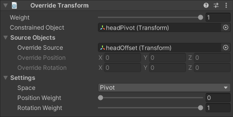

# Override Transform

An Override Transform constraint allows you to override the Constrained Object's transform with a value coming from an Override Source, or from manually specified values.

|Properties|Description|
|---|---|
|Weight|The overall weight of the constraint. If set to 0, the constraint has no influence on the Constrained Object. When set to 1, it applies full influence with the current settings. Intermediate values are interpolated linearly.|
|Constrained Object|The GameObject affected by the Override source.|
|Override Source|The GameObject that influences the Constrained Object's transform. If specified, Override Position and Override Rotation fields are ignored.|
|Override Position|A specific position value to apply to the Constrained Object. This value is ignored if an Override Source is specified.|
|Override Rotation|A specific rotation value to apply to the Constrained Object. This value is ignored if an Override Source is specified.|
|Space|Specifies how the Override Source's local transform values (or manual Override Position and Rotation) should be applied to Constrained Object.|
|Position Weight|The weight of the position influence. A weight of 1 causes the constrained GameObject to be fully influenced by its Override source.|
|Rotation Weight|The weight of the rotation influence. A weight of 1 causes the constrained GameObject to be fully influenced by its Override source.|

Space can have the following values:

|Values|Description|
|---|---|
|World|The displacement of the Override Source's local transform values _replace_ the Constrained Object's global transform values.|
|Local|The displacement of the Override Source's local transform values _replace_ the Constrained Object's local transform values.|
|Pivot|The displacement of the Override Source's local transform values are _added to_ The Constrained Object's local transform values.|

_In each case, the initial position of the Override Source GameObject at the time the constraint is created, is treated as the point of reference for calculating its displacement._
