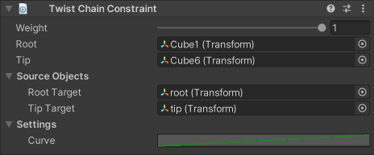

# TwistChain Constraint

The Twist Chain constraint allows you to control world rotations on both ends of a GameObject chain hierarchy.
The constraint calculates interpolated rotations for intermediate transforms between a Root and Tip to create a smooth animated hierarchy.

|Properties|Description|
|---|---|
|Weight|The overall weight of the constraint. If set to 0, the constraint has no influence on the chain elements. When set to 1, it applies full influence with the current settings. Intermediate values are interpolated linearly.|
|Root|The root GameObject of the chain hierarchy.|
|Tip|The final GameObject of the chain hierarchy. It must be a descendant of the Root GameObject.|
|Root Target|The GameObject that specifies the desired target rotation for the chain's Root.|
|Tip Target|The GameObject that specifies the desired target rotation for the chain's Tip.|
|Curve|A curve with a normalized domain and range, specifying how the twist rotation should be distributed down the length of the chain.|
