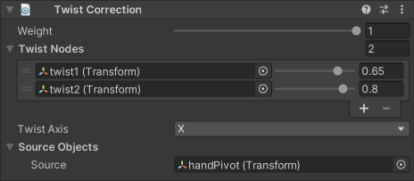

# Twist Correction

The Twist Correction constraint redistributes a percentage of a Source's rotation to one or more Twist Nodes in order to correct the twist deformation of a body part that rotates on multiple axes.
Common use cases are shoulders, wrists, and upper legs.

|Properties|Description|
|---|---|
|Weight|The overall weight of the constraint. If set to 0, the constraint has no influence on the Twist Nodes. When set to 1, it applies full influence with the current settings. Intermediate values are interpolated linearly.|
|Source|The GameObject that influences the Twist Nodes to rotate around a specific Twist Axis.|
|Twist Axis|Specifies the axis on the Source object from which the rotation is extracted and then redistributed to the Twist Nodes.|
|Twist Nodes|The list of GameObjects that will be influenced by the Source GameObject, and the cumulative percentage of the Source's twist rotation they should inherit. They are generally expected to all be leaf nodes in the hierarchy (i.e., they have a common parent and no children), and to have their twist axes oriented the same as the Source object in their initial pose.|
