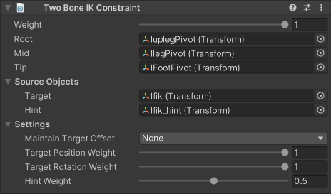

# Two Bone IK

The Two Bone IK constraint allows you to invert the control of a simple hierarchy of two GameObjects, so the Tip of a limb can reach a Target position.
An additional Hint GameObject allows you to specify the direction the limb should be oriented when it bends.

|Properties|Description|
|---|---|
|Weight|The overall weight of the constraint. If set to 0, the constraint has no influence on the limb elements. When set to 1, it applies full influence with the current settings. Intermediate values are interpolated linearly.|
|Root|The root GameObject of the limb hierarchy.|
|Mid|The middle GameObject of the limb hierarchy. It must be a child of the Root GameObject.|
|Tip|The final GameObject of the limb hierarchy. It must be a child of the Mid GameObject.|
|Target|Source GameObject that specifies the desired position of the Tip.|
|Hint|Optional Source GameObject, whose position is used to specify the direction the limb should be oriented when it bends.|
|Maintain Target Offset|Specifies whether to maintain the initial offset between the Tip and the Target. You can retain any combination of either Position and/or Rotation offset.|
|Target Position Weight|The weight to apply for calculating the desired position when reaching for the Target. If set to 1, the Root and Mid objects will extend as far as necessary to try to reach the specified Target position. As with the constraint's overall weight, intermediate values are interpolated linearly.|
|Target Rotation Weight|The weight of the rotation applied to the Tip. If set to 1, the Tip aligns it rotation to the specified Target. As with the constraint's overall weight, intermediate values are interpolated linearly.|
|Hint Weight|The amount of influence the Hint has on the configuration of the hierarchy. When set to 1, the Hint fully influences the hierarchy configuration. If no Hint GameObject is specified, the hint weight is ignored.|

## Auto Setup from Tip Transform

The component's context menu available from its header in the Inspector provides a "Auto Setup from Tip Transform" option.
This menu command will automatically create and assign both a Target and Hint GameObject in your Rig's hierarchy.
To use this option:

1. Add a Two Bone IK Constraint to a GameObject in your Rig hierarchy.
2. Assign the Tip GameObject.
3. Select "Auto Setup from Tip Transform" from the component's context menu.
